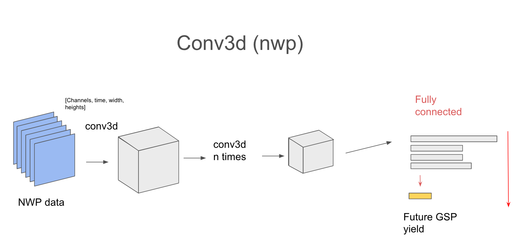

# Nowcasting Forecast

[](https://codecov.io/gh/openclimatefix/nowcasting_forecast)

Making live forecasts for the nowcasting project.
The aim is to produce Grid Supply Point (GSP) Solar generation Forecasts.
This is done by loading live PV results, Numerical Weather Predictions (NWPs) and Satellite images,
and running this data through various different ML models.

You can run the application locally by:
```bash
python nowcasting_forecast/app.py --db-url='sqlite:///test.db'
```

## Installation with conda

```shell
mamba env create -f environment.yml
conda activate nowcasting_forecast

# Installing fastai inside environment.yml is currently broken. So install separately:
mamba install -c fastchan fastai

# You need to manually install nowcasting_dataset, nowcasting_datamodel,
# nowcasting_dataloader, and power_perceiver. This can be done via pypi (for all except
# power_perceiver) or by git cloning the repo and using:
pip install -e <path_to_directory>

# Install nowcasting_forecast
pip install -e .

# You may also want to install dev tools:
mamba install pytest flake8 black pre-commit pydocstyle isort mypy
pre-commit install
```

## Directories and files
The following shows the main files

```
+-- nowcasting_forecast
|   +-- config
|       +-- mvp_v0.yaml
|       +-- mvp_v1.yaml
|   +-- models
|       +-- nwp_solar_simple.py
|       +-- nwp_solar_simple_trained
|           +-- model.py
|       +-- cnn
|           +-- cnn.py
|           +-- dataloader.py
|           +-- model.py
|   +-- app.py
|   +-- batch.py
|   +-- dataloader.py
+-- scripts
+-- tests
```

### ☀️ nowcasting_forecast

`app.py` is the main entry point for running the forecast module. It contains the following arguments:
- --db-url: the database url that the forecasts will be saved too
- --fake: Create fake forecast, mainly used for testing

The app has three main steps
1. Make batched data
2. Run forecasting model to make forecasts
3. Save forecasts to the database

`batch.py` is used to load the data and create batches of data. This uses mainly used [ManagerLive](https://github.com/openclimatefix/nowcasting_dataset/blob/main/nowcasting_dataset/manager/manager_live.py#L29)

`dataloader.py` is used to load the batched data in an efficient way. This is current a stripped down version of this [dataloader](https://github.com/openclimatefix/nowcasting_dataloader).

The `config` directory contains configurations that are used to load different data sources.
The configuration is used by `batch.py` to convert large amounts of data into batched data, which is then ready for ML models.

The `database` directory contains database models and functions to interact with the database. See [below](#data-model) for more information

The `model` directory contains ml models to make forecasts. See [below](#models) for more information

## Models

### NWP Simple

This takes the average 'dswrf' for each example and then divides this by 10 to give a rough model for MW per GSP

configuration: mvp_v0.yaml

### NWP Simple trained

CNN model of 'dswrf' channel in NWP. 6 CNN layers then 4 fully connected layers.



Training run: https://app.neptune.ai/o/OpenClimateFix/org/predict-pv-yield/e/PRED-951/charts

configuration: mvp_v1.yaml

### CNN

This model takes both satellite and NWP video data and puts them through
separate 3D convolutional neural networks. These are then connected with
a few fully connected layers, joined with some simple input data like
historic PV data.

## 🩺 Testing

Tests are run with `pytest`

These sets up `postgres` in a docker container.
This slightly more complicated testing framework is needed (compared to running `pytest`)
as some queries can not be fully tested on a `sqlite` database

## 🛠️ infrastructure

`.github/workflows` contains a number of CI actions
1. linters.yaml: Runs linting checks on the code
2. release.yaml: Make and pushes docker files on a new code release
3. test-docker.yaml': Runs tests on every push

The docker file is in the folder `infrastructure/docker/`

The version is bumped automatically for any push to `main`.


## Environmental Variables

- DB_URL: The database url which the forecasts will be saved too
- DB_URL_PV: The database url for the PV data
- NWP_ZARR_PATH: Override NWP data path. This is useful when running this locally, and shows to get data from the cloud.
- SATELLITE_ZARR_PATH: Override Satellite data path. This is useful when running this locally, and shows to get data from the cloud.
- FAKE: Option to make fake/dummy forecasts
- MODEL_NAME: Optional of 'nwp_simple' or 'nwp_simple_trained'
