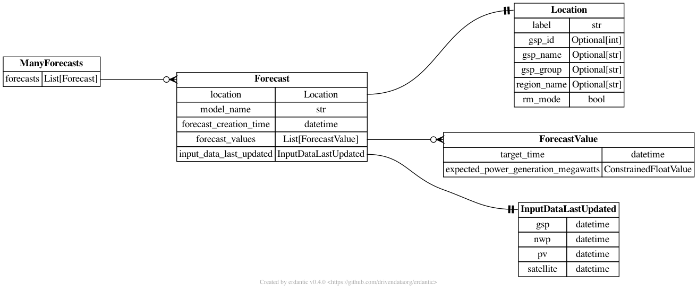

# Nowcasting Forecast

[](https://codecov.io/gh/openclimatefix/nowcasting_forecast)

Making live forecasts for the nowcasting project.
The aim is to produce Grid Supply Point (GSP) Solar generation Forecasts.
This is done by using live PV results, Numerical Weather Predictions (NWPs) and Satellite images.

You can run the application localy by:
```bash
python nowcasting_forecast/app.py --db-url='sqlite:///test.db'
```

## Directories and files
The following shows the main files

```
+-- nowcasting_forecast
|   +-- config
|       +-- mvp_v0.yaml
|   +-- database
|       +-- connection.py
|       +-- models.py
|       +-- national.py
|       +-- read.py
|       +-- save.py
|   +-- models
|       +-- nwp_solar_simple.py
|   +-- app.py
|   +-- batch.py
|   +-- dataloader.py
+-- scripts
+-- tests
```

### ☀️ nowcasting_forecast

`app.py` is the main entry point for running the forecast module. It contains the following arguments:
- --db-url: the database urls that the forecasts will be saved too
- --fake: Create fake forecast, mainly used for testing

The app has three main steps
1. Make batched data
2. Run forecasting model to make forecasts
3. Save forecasts to the database

`batch.py` is used to load the data and create batches of data. This uses mainly used [ManagerLive](https://github.com/openclimatefix/nowcasting_dataset/blob/main/nowcasting_dataset/manager/manager_live.py#L29)

`dataloader.py` is used to load the batched data in an efficient way. This is current a stripped down version of this [dataloader](https://github.com/openclimatefix/nowcasting_dataloader).

The `config` directory contains configurations that are used to load different data sources.
The configuration is by `batch.py` to convert large amounts of data into batched data, which is then ready for ML models.

The `database` directory contains database models and functions to interact with the database. See [below](#data-model) for more information

The `model` directory contains ml models to make forecasts. See [below](#models) for more information


### Models

#### v0
This model is a simple model that uses NWP solar irradiance data to prediction solar generation.
⚠️ This model takes the average solar irradiance and divides by 10, which will not produce a very accurate forecast.
The main purpose of this model is to test the data pipeline.

The model performs the following steps:
1. Creates a data loader
2. Run simple model by looping over batches for all GSP
3. Make national forecast

#### v1

 TODO

### Data model

The data model has been made using `sqlalchemy` with a mirrored model in `pydantic`.

⚠️ Database tables are currently made automatically,
but in the future there should be a migration process

Future: The data model could be moved, to be a more modular solution.

#### models.py
All models are in `nowcasting_forecast.database.models.py`.
The diagram below shows how the different table are connected.



#### connection.py

`nowcasting_forecast.database.connection.py` contains a connection class which can be used to make a sqlalchemy session.
```python
from nowcasting_forecast.database.connection import DatabaseConnection

# make connection object
db_connection = DatabaseConnection(url='sqlite:///test.db')

# make sessions
with db_connection.get_session() as session:
    pass
```

#### 👓 read.py

`nowcasting_forecast.database.read.py` contains functions to read the database.
The idea is that these are easy to use functions that query the database in an efficient and easy way.

 - get_latest_forecast: Get the latest `Forecast` for a specific GSP.
 - get_all_gsp_ids_latest_forecast: Get the latest `Forecast` for all GSPs.
 - get_forecast_values: Gets the latest `ForecastValue` for a specific GSP
 - get_latest_national_forecast: Returns the latest national forecast
 - get_location: Gets a `Location` object

```python
from nowcasting_forecast.database.connection import DatabaseConnection
from nowcasting_forecast.database.read import get_latest_forecast

# make connection object
db_connection = DatabaseConnection(url='sqlite:///test.db')

# make sessions
with db_connection.get_session() as session:
    f = get_latest_forecast(session=session, gsp_id=1)
```

#### 💾 save.py
`nowcasting_forecast.database.save.py` has one functions to save a list of `Forecast` to the database

#### 🇬🇧 national.py
`nowcasting_forecast.database.fake.py` has a useful function for adding up forecasts for all GSPs into a national Forecast.

#### fake.py
`nowcasting_forecast.database.fake.py`

Functions used to make fake model data.


## 🩺 Testing

Tests are run by using the following command
```bash
docker-compose -f test-docker-compose.yml run forecast
```

These sets up `postgres` in a docker container and runs the tests in another docker container.
This slightly more complicated testing framework (compared to running `pytest`) is needed some queries can not be fully tested on a `sqlite` database

## 🛠️ infrastructure

`.github/workflows` contains a number of CI actions
1. linters.yaml: Runs linting checks on the code
2. release.yaml: Make and pushes docker files on a new code release
3. test-docker.yaml': Runs tests on every push

The docker file is in the folder `infrastructure/docker/`

The version is bumped automatically for any push to `main`.


## Environmental Variables

- DB_URL: The database url which the forecasts will be saved too
