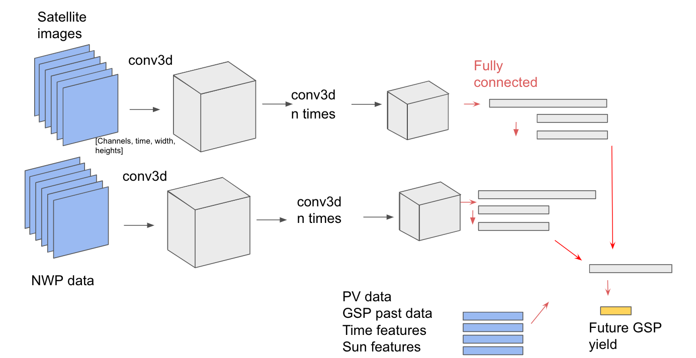

# CNN model

This model takes both satellite and NWP video data and puts them through
separate 3D convolutional neural networks. These are then connected with
a few fully connected layers, joined with some simple input data like
historic PV data. In addition, datetime features are
added, and the position of the Sun is also used
(‘elevation’ and ‘azimuth’ angles).

## versions

### PVNet v1 

Add 4 NWP data, and use 3 hours of NWP forcast

https://app.neptune.ai/o/OpenClimateFix/org/predict-pv-yield/e/PRED-1238/

### MVP v5

Update to new GSP data

https://app.neptune.ai/o/OpenClimateFix/org/predict-pv-yield/e/PRED-1197/

### MVP v4

This model can still predict GSP, even if GSP historic data is NaN.

https://app.neptune.ai/o/OpenClimateFix/org/predict-pv-yield/e/PRED-1192/

### MVP v3

The model can predict GSP through the night. This was done by including
night time training data.

https://app.neptune.ai/o/OpenClimateFix/org/predict-pv-yield/e/PRED-1171/

### MVP v2

Added sun features

https://app.neptune.ai/o/OpenClimateFix/org/predict-pv-yield/e/PRED-1042/

### MWP v1

First iteration of the model

https://app.neptune.ai/o/OpenClimateFix/org/predict-pv-yield/e/PRED-1004/

/app.neptune.ai/o/OpenClimateFix/org/predict-pv-yield/e/PRED-1042/
